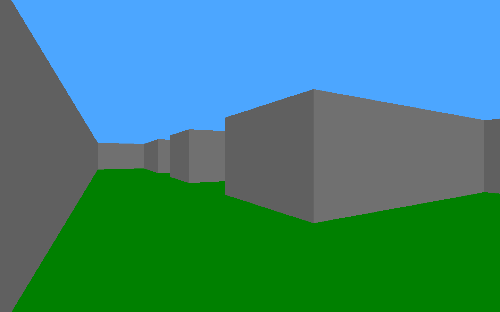

# Tasks

Here is a list of tasks to build your raycasting game:

## 0. Walls

In this first part, you’ll have to:

- Create a window with SDL2.
- Use raycasting to draw walls on your window.
- Provide a way to change the angle of the camera in your code to see if it works after recompiling it.
- Ensure that the color of the walls is different from the color of the ground/ceiling.
- Provide a way to modify the map in your code to see if it works after recompiling it (e.g., using an array of arrays of integers or characters).

Example:

## 1. Orientation

In this part, you must draw a different color depending on the orientation of the walls. You must draw walls facing NORTH and SOUTH in a different color from walls facing EAST and WEST.

Example:

## 2. Rotation

You must provide a way to rotate the camera during the execution. For example, you can rotate the camera when the left and right arrow keys are pressed on the keyboard or when the mouse moves (like a FPS game).

Example:

## 3. Move

You must provide a way to move the camera during the execution. For example, you can move the camera when the W, A, S, and D keys are pressed on the keyboard.

Example:

## 4. Ouch!

In this part, you must handle collisions between the player (camera) and the walls. The player must not be able to enter walls. You can make the player slide on the walls instead of stopping abruptly.

## 5. Parser

In this part, you must implement a parser to read the map from a file. You are free to define the standards for your map, such as the character representation for walls and empty spaces, the file extension, etc. Your program should accept a parameter specifying the path to the map file.

## 6. Draw the map

In this part, you must draw the map on the window. You are free to choose the location and colors for the map. You should provide a way to enable/disable the map display during the execution. Additionally, include the player's line of sight in the map.

## 7. Coding Style + Documentation

Check if your code adheres to the coding style guidelines of your chosen programming language or framework. Ensure that your code is well-documented, following the recommended documentation format.

## 8. Textures

Add textures to the walls to enhance their appearance.

Example:

## 9. Multi-task!

Add the ability to move in several directions and rotate simultaneously. Handle multiple events on the same frame. For example, if the keys to move are W, A, S, and D:

- If the keys W and S are pressed at the same time, the player should not move.
- If the keys W and D are pressed at the same time, the player should move forward and to the right simultaneously.

## 10. Ground Textures

Add textures to the ground and/or ceiling to enhance their appearance.

Example:

## 11. Weapons

Add textures for weapons to provide a more immersive experience.

Example:

## 12. Enemies

Add enemies to your game to create challenges for the player.

Example from the game Wolfenstein 
